# WildRoute: Explore and share outdoor activities in Australia

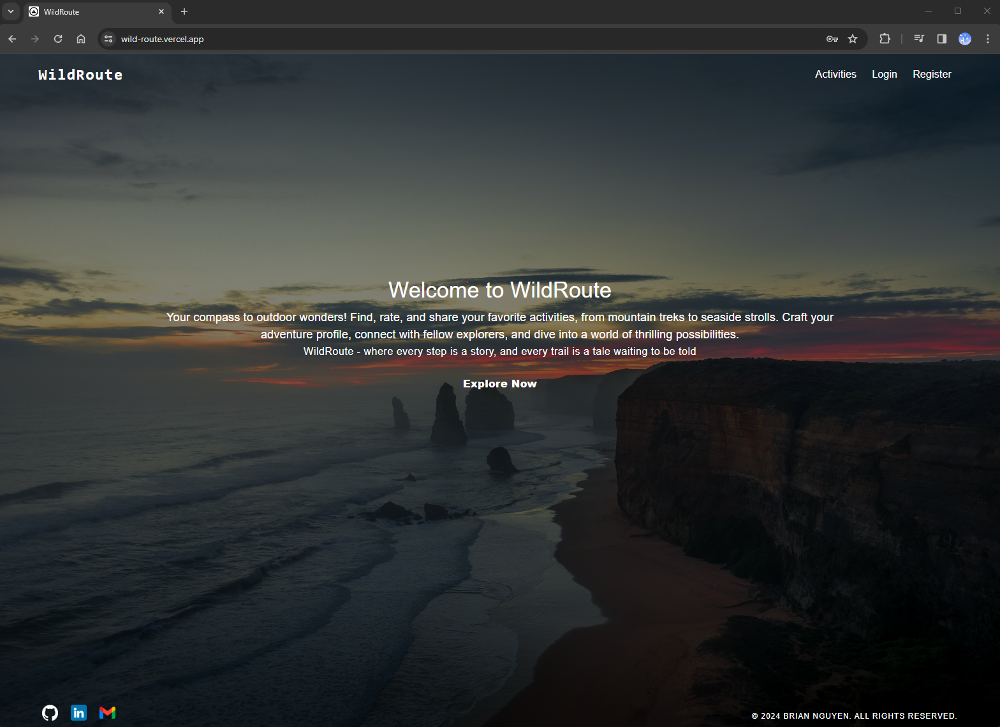

## Project Description

WildRoute is an activity discovery app where users can create, rate, and review activities. providing specific locations, which helps users to discover various adventures.

### Key Features

- **Activities Listing:** Explore a list of activities to find the perfect adventure.
- **Search Functionality:** Search for activities by name or category for a personalized experience.
- **User Accounts:** Create an account to unlock features like rating, reviewing, and managing your own activities.
- **Rating and Reviewing:** Share your experiences and insights by providing ratings and reviews for activities.
- **Activity Management:** Take control by creating, editing, and deleting your own activities.
- **Location Details:** Get specific location information for each activity.

### Table of Contents

- [Demo](#demo)
- [Technology Stack](#technology-stack)
- [Features](#features)
- [Prerequisites](#prerequisites)
- [Installation](#installation)
- [Deployment](#deployment)
- [Acknowledgments](#acknowledgments)
- [Contact](#contact)

### Demo

WildRoute Link: <https://wild-route.vercel.app/>

- You can use the credentials bellow to sign in or create your own to explore the app:
    - username: admin
    - password: admin

Live Demo: **In progress**.

### Technology Stack

- **Front-End:** [React](https://react.dev/), [React Router](https://reactrouter.com/en/main), [React Hook Form](https://www.react-hook-form.com/), [Material-UI library](https://mui.com/), and [MapBox](https://www.mapbox.com/).
- **Back-End:** [Node.js](https://nodejs.org/en), [ExpressJS](https://expressjs.com/).
- **Database:** [MongoDB](https://www.mongodb.com/), [Redis](https://redis.com/) (storing JWT), [Cloudinary](https://cloudinary.com/) (storing images).
- **Deployment:**
  - [Render](https://render.com/) (Backend)
  - [Vercel](https://vercel.com/) (Frontend)
- **Others:** [TypeScript](https://www.typescriptlang.org/), [JSON Web Token (JWT)](https://jwt.io/) for managing tokens and [Passport](https://www.passportjs.org/) for `Authentication`, [Multer](https://www.npmjs.com/package/multer) for handling `multipart/form-data`.

### Features

- **Dynamic activity listing:**

  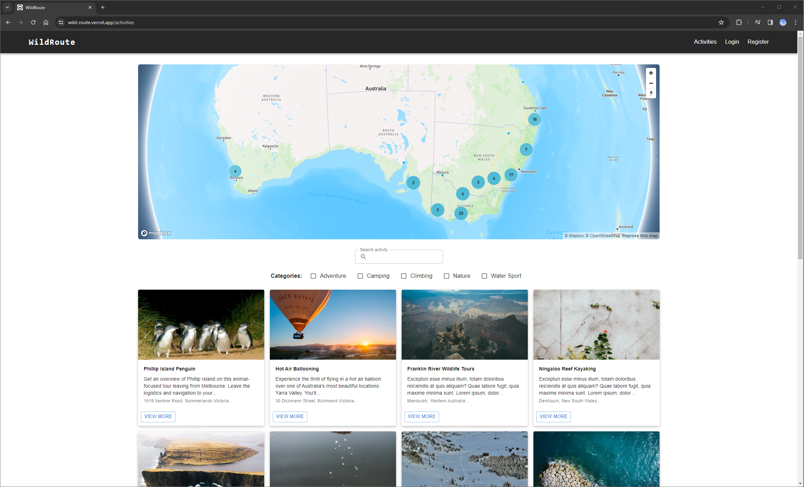

- **Interactive map:**

  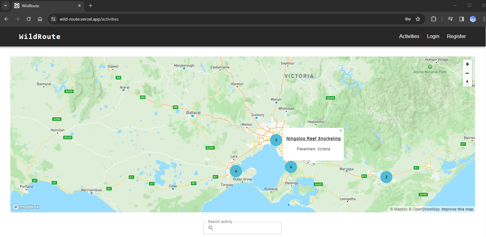

- **Search activities by text and categories:**

  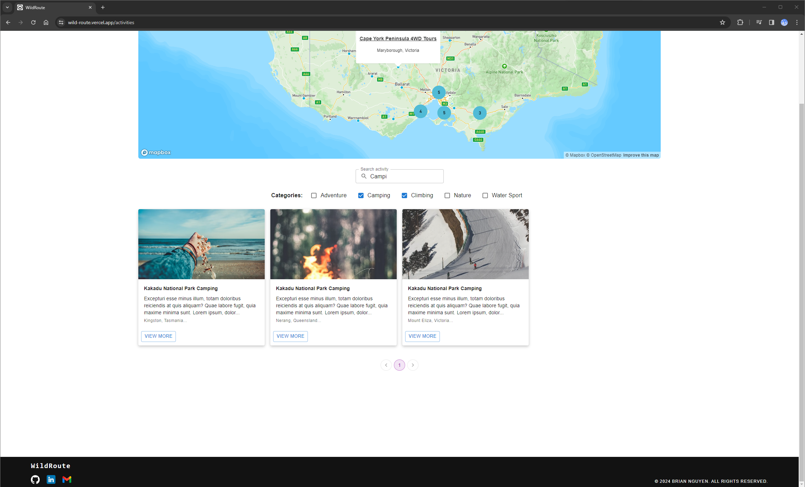

- **Show detail of an activity:**

  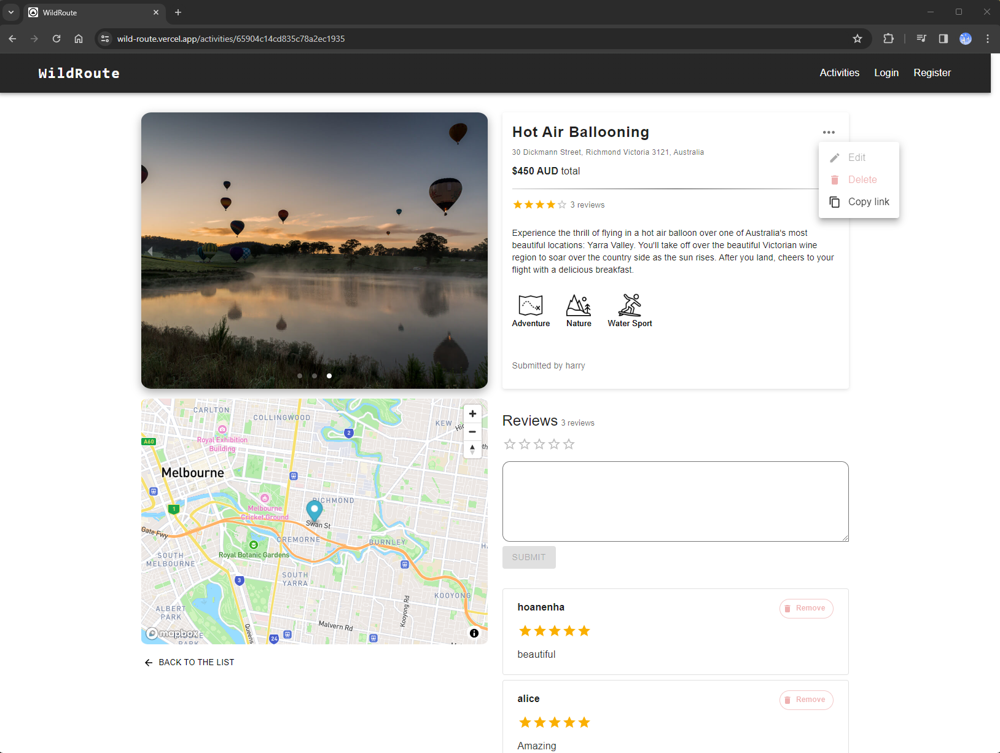**Note: Delete and Edit are not allowed if not logged in**

- **Sign In**

  - you can use the credentials bellow to sign in or create your own:
    - username: admin
    - password: admin

  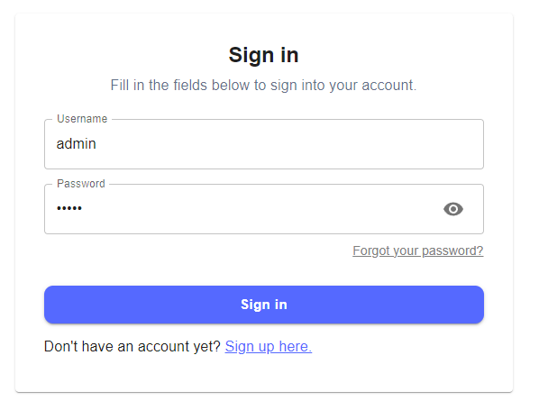
  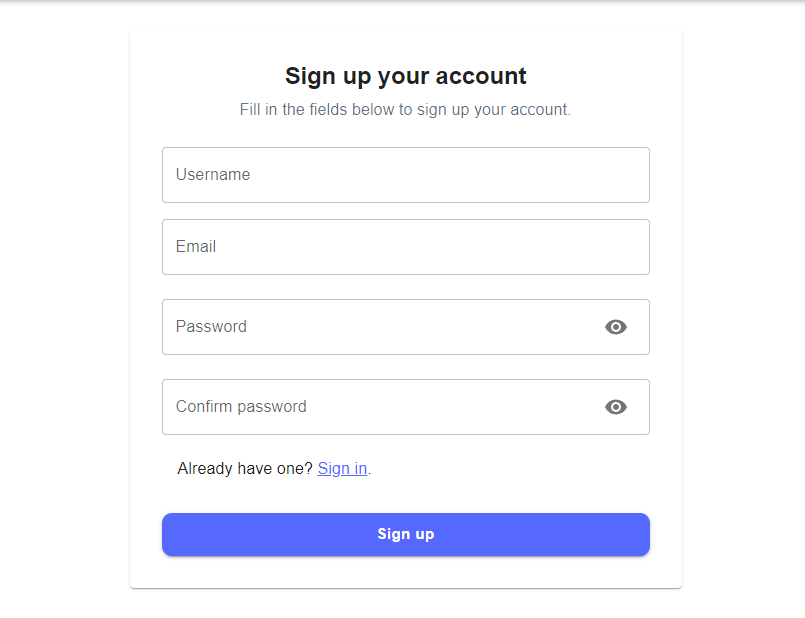

  - In case you forgot your password, there is `forgot your password?` here to reset your password:
  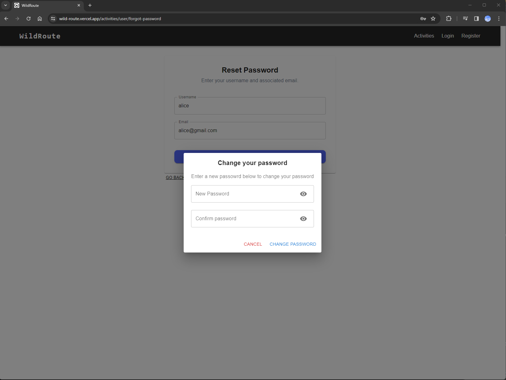

- **Once you are signed in, you can create your own activity. the activity is also updated on the map**
  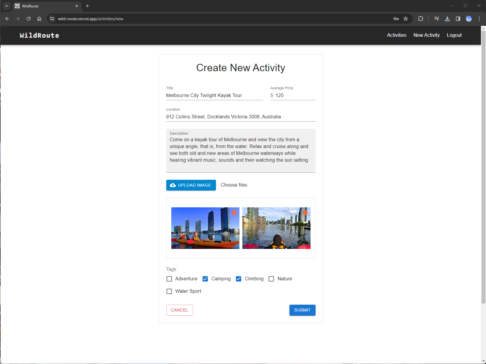

  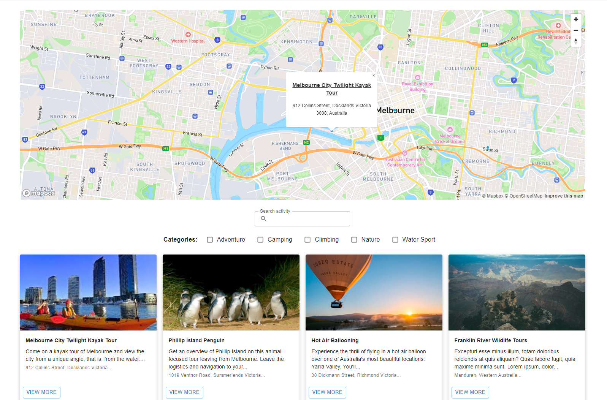

- **As the owner of the activity, you have permission to edit or delete it**

  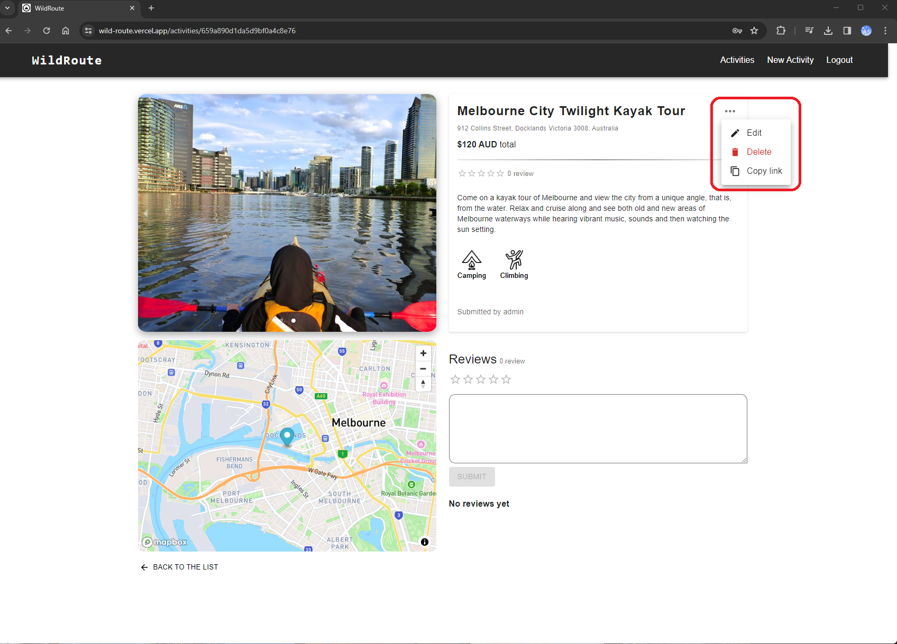

- **Review on other activities**

  - Only the owner of the review can delete their review
  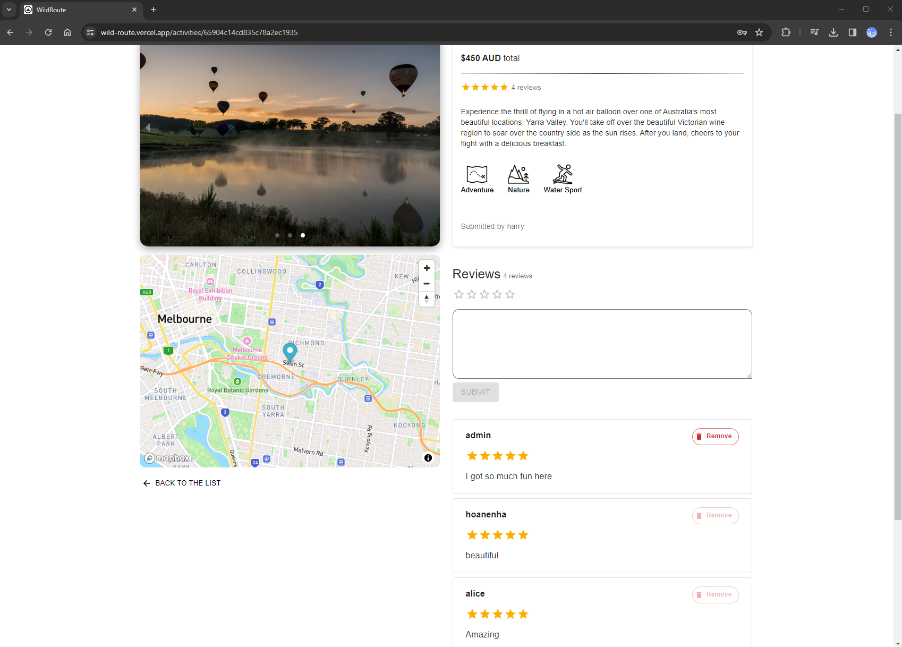

**You can try out or the mentioned features at [Demo](#demo) section.**

### Prerequisites

Before running Wildroute locally, ensure you have the following prerequisites installed on your machine:

- **Node.js:** Make sure you have Node.js installed. You can download it from [here](https://nodejs.org/).

- **MongoDB:** Install MongoDB and make sure it's running. You can download it from [here](https://www.mongodb.com/try/download/community).

- **Redis:** Install and start the Redis server. You can download it from [here](https://redis.io/download).

- **Git:** Install Git for version control. You can download it from [here](https://git-scm.com/).

- **A Code Editor:** Choose a code editor of your choice. We recommend [Visual Studio Code](https://code.visualstudio.com/).

### Installation

Follow these steps to set up Wildroute on your local machine:

1. **Clone the Repository:**
   - Open your terminal and run the following command:

     ```bash
         git clone https://github.com/Brian3010/WildRoute.git
     ```

2. **Navigate to the Backend:**
   - Change into the backend directory:

     ```bash
     cd WildRoute/backend
     ```

3. **Install Backend Dependencies:**
   - Run the following command to install the backend dependencies:

     ```bash
     npm install
     ```

4. **Build and Start Backend:**
   - Run the following command to build the backend:

     ```bash
     npm run build
     ```

   - Then, start the backend server:

     ```bash
     npm start
     ```

   - Alternatively, if you want to watch for changes during development, you can use:

     ```bash
     npm run serve
     ```

   - **Note:** The backend is running at [http://localhost:3000/](http://localhost:3000/). Ensure that the frontend is configured to connect to this URL when making requests.

5. **Navigate to the Frontend:**
   - Change into the frontend directory:

     ```bash
     cd ../frontend
     ```

6. **Install Frontend Dependencies:**
   - Run the following command to install the frontend dependencies:

     ```bash
     npm install
     ```

7. **Start Frontend:**
   - Run the following command to start the frontend:

     ```bash
     npm run dev
     ```

   - This will start the frontend using Vite.

   - **Note:** Ensure that your frontend `.env` file is configured to connect to the backend URL [http://localhost:3000/](http://localhost:3000/) for API requests.

8. **Environment Variables:**
   - Create a `.env` file in the root of the backend folder and frontend folder respectively and add any required environment variables.
   **Note:** If you need assistance or have any questions regarding the required environment variables, feel free to reach out! Contact me at [briannguyenwg@gmail.com](mailto:briannguyenwg@gmail.com) for any inquiries.

9. **Access the App:**
   - Open your browser and go to the URL provided by VITE when running `npm run dev`.

### Deployment

- The backend is deployed on [Render](https://docs.render.com/deploy-node-express-app). The APIs available at [Backend APIs](https://wildroute-api.onrender.com).
- The frontend is deployed on [Vercel](https://vercel.com/docs/frameworks/vite).

### Acknowledgments

- **[Mapbox](https://www.mapbox.com/):** Provided an outstanding mapping platform that greatly enriched the visual presentation of location-based data in WildRoute.

- **[Material-UI (MUI)](https://mui.com/):** Powerful React UI framework. MUI significantly contributed to the aesthetics and user experience of WildRoute.

- **[React Router](https://reactrouter.com/):** Simplified navigation and ensured smooth transitions between different views in WildRoute.

- **[React Hook Form](https://react-hook-form.com/)**

- **[Mongoose Docs](https://mongoosejs.com/docs/)**

- **[Passport](http://www.passportjs.org/):** Passport played a vital role in handling authentication in WildRoute

- **[jsonwebtoken](https://www.npmjs.com/package/jsonwebtoken):** The `jsonwebtoken` library was instrumental in implementing secure authentication mechanisms in WildRoute.

- **[multer](https://www.npmjs.com/package/multer):** Multer simplified the process of handling file uploads in WildRoute

These tools and libraries have not only enhanced the functionality of WildRoute but also contributed to the overall success of the project.

### Contact

Feel free to reach out if you have any questions, suggestions, or just want to connect! You can contact me via:

- **Email:** [briannguyenwg@gmail.com](mailto:briannguyenwg@gmail.com)
- **LinkedIn:** [https://www.linkedin.com/in/brian-nguyen-411483196/](https://www.linkedin.com/in/brian-nguyen-411483196/)
- **GitHub:** [https://github.com/Brian3010](https://github.com/Brian3010)
